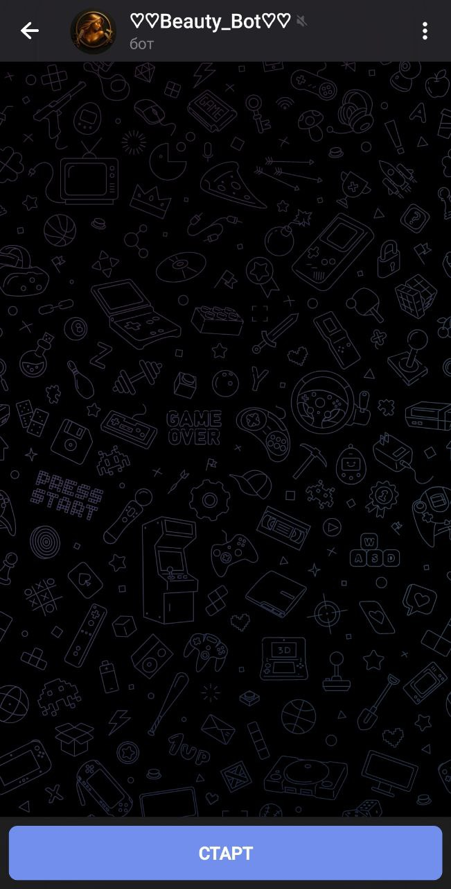
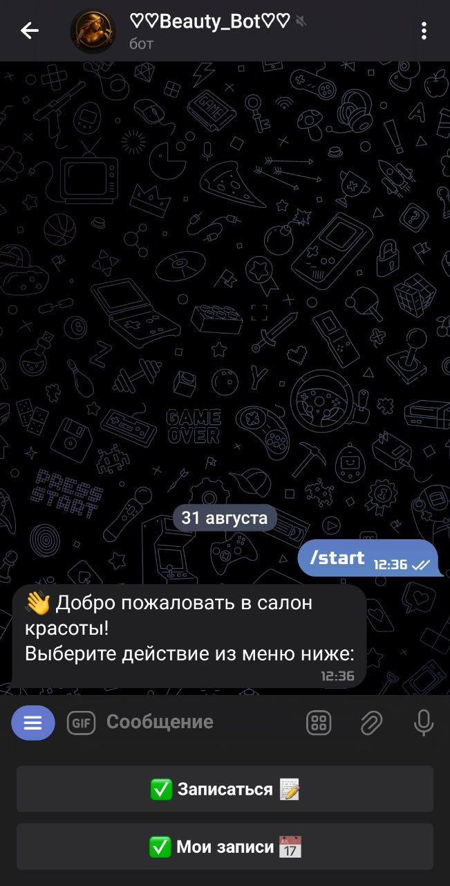
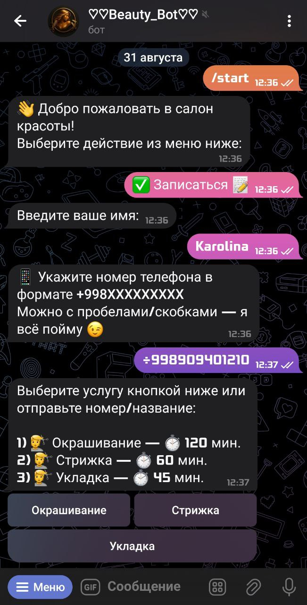
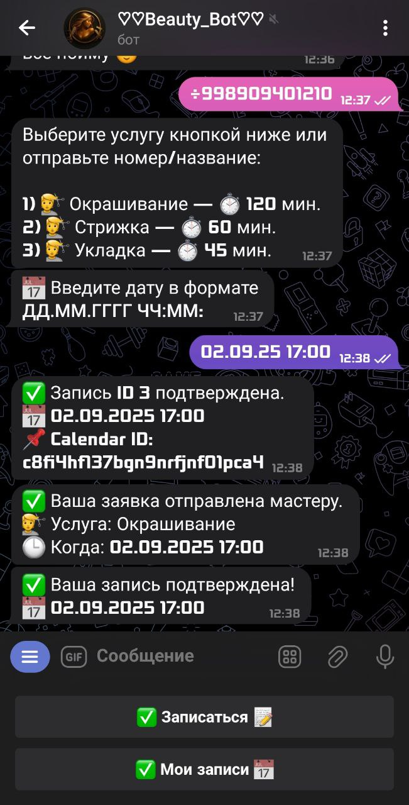
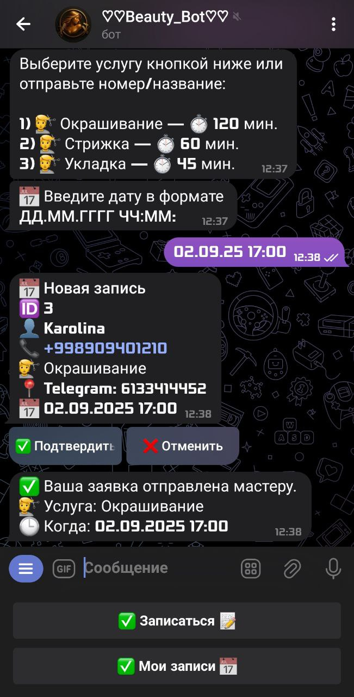
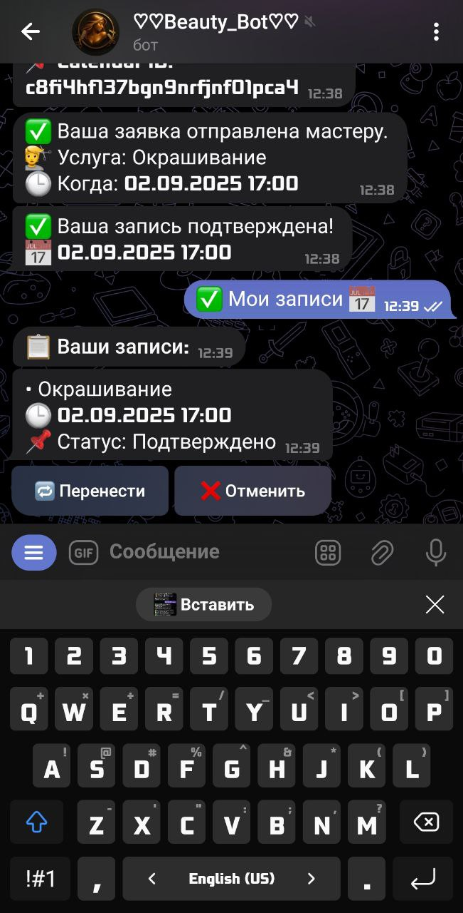
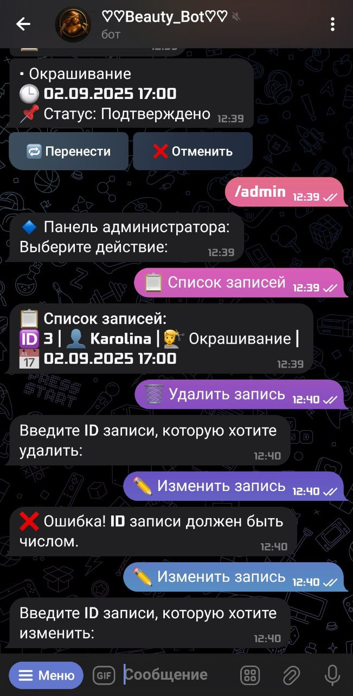
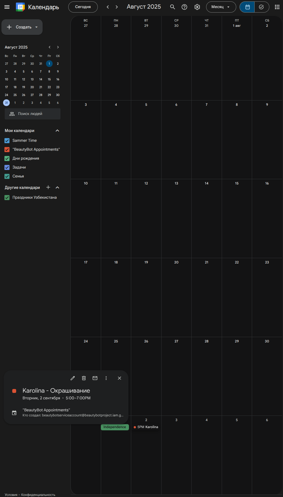

## 💇‍♀️ Telegram Beauty Bot

## 🌟 Project Description

**A Telegram bot for online booking of haircuts, styling, and other beauty services with Google Calendar integration. Suitable for both salons and independent beauty professionals.**

## The project demonstrates skills in integrating a Telegram bot with external APIs (Google Calendar, Google Sheets), working with databases, Redis, Docker, and implementing full business logic.


## 📌 Features

✅ Client booking via step-by-step form (name → phone → service → date/time)

✅ Phone number validation (+998XXXXXXXXX format)

✅ Service selection via inline buttons (haircut, styling, coloring, brows, etc.)

✅ Automatic availability check and time conflict prevention

✅ Appointment approval or rejection by the specialist

✅ Automatic client notifications about booking status

✅ Automatic notifications to the specialist (Telegram & Calendar)

✅ Google Calendar integration (appointments appear in the master’s calendar)

✅ Google Sheets integration (appointments are automatically saved to a spreadsheet)

✅ Ability for the client to reschedule or cancel an appointment

✅ Detailed notifications for the specialist: name, phone, service, date/time

✅ Admin panel for managing appointments

🔜 Client reminders (24h / 2h before the appointment)


## 🛠 Tech Stack

- Python 3.10+

- Aiogram 3.x

- PostgreSQL — appointment storage

- SQLAlchemy + Alembic — ORM & migrations

- Redis — FSM (state machine) and caching

- Docker + docker-compose — deployment

- Google Calendar API — schedule synchronization


## 🚀 Deployment & Run (Docker)

1) Environment setup

# Clone the repository
* git clone https://github.com/Mr-Shams86/beauty_bot.git
* cd beauty_bot

# Create .env from the example
* cp .env.example .env

# Edit .env: BOT_TOKEN, ADMIN_ID, GCAL_CALENDAR_ID, etc.

# Add Google service account key
* mkdir -p secrets

# The file must be named:
# gcal-service-account.json

# And placed here:
# ./secrets/gcal-service-account.json

2) Build & Run

# Full rebuild (after changing dependencies)
* docker-compose build --no-cache

# Start all services
* docker-compose up -d

3) Run migrations

* Migrations are usually applied automatically in entrypoint.sh, but you can also run them manually:

* docker-compose exec bot alembic upgrade head

4) Logs & Management

# View bot logs
docker-compose logs -f bot

# Restart only the bot
docker-compose restart bot

# Stop all services
docker-compose down


## 📖 Bot Commands

| Command            | Description                        |
| ------------------ | ---------------------------------- |
| `/start`           | Start the bot                      |
| `/add_appointment` | Create a new appointment           |
| `/appointments`    | View all appointments (admin only) |
| `/get_id`          | Get your Telegram ID               |


## 📂 Project Structure

```
📦 beauty_bot
.
├── alembic/                            🗂️ Database migrations
│   ├── env.py                           ⚙️ Alembic environment setup
│   ├── script.py.mako                   📜 Migration generation template
│   └── versions/                        📜 Migration scripts
│       ├── 0001_create_appointments.py              🏗️ Create appointments table
│       ├── 0002_add_users_and_services.py           ➕ Users & services tables
│       ├── 0003_make_appointments_name_nullable.py  ✏ Make name field nullable
│       ├── 0004_add_phone_to_users.py               📞 Add phone to users
│       └── f4f775f37abe_make_appointments_name_nullable_indexes_.py ⚡ Add indexes
│
├── alembic.ini                          ⚙️ Alembic configuration
├── bot.py                               🤖 Bot entry point
├── config.py                            🔧 Project configuration (env variables)
├── database.py                          🗄️ DB models and functions
├── docker-compose.yml                   🐳 Docker Compose setup
├── Dockerfile                           📦 Application Docker image
├── entrypoint.sh                        🚀 Startup script & migrations
│
├── handlers/                            🎮 Command handlers
│   ├── admin.py                         👨‍💼 Admin logic
│   └── client.py                        🙋 Client logic (booking, viewing)
│
├── healthcheck.py                       🩺 Service health check
├── keyboards.py                         🎹 Inline / Reply keyboards
│
├── middlewares/                         🛡️ Middleware
│   └── throttling.py                    ⏱️ Anti-spam throttling
│
├── README.md                            📘 Project documentation
├── requirements.txt                     📋 Python dependencies
│
├── scheduler/                           ⏰ Task scheduler
│   └── reminders.py                     🔔 Appointment reminders
│
├── secrets/                             🔐 Secrets & keys
│   └── gcal-service-account.json        📄 Google service account key
│
├── services/                            🛠️ Business logic services
│   ├── appointments.py                  📅 Appointment management
│   └── calendar.py                      📆 Google Calendar integration
│
├── structure.txt                        📝 Clean project structure
├── Task                                 📄 Notes / tasks
│
└── utils/                               🔧 Utility functions
    ├── helpers.py                       🛠️ Date parsing, timezone, etc.
    └── logging.py                       🪵 Logging configuration


```

## 🔗 Links

- [GitHub repository:](https://github.com/Mr-Shams86/beauty_bot)

- [Telegram booking bot:](@beauty2525_bot)


## 📸 Beauty Bot Demo

## 1. Bot start  


## 2. Main menu 


## 3. Service booking 


## 4. Date & confirmation 




## 5. My appointments  


## 6. Admin panel  


### 7. Google Calendar integration
Appointments are automatically created in the expert’s calendar:  


## 8. Google Sheets integration
All appointments are duplicated in a spreadsheet for record keeping:  


## 🎥 Video Demo
Full demo (3 minutes) is available in the repository:  
[Download & ▶️ Watch demo.mp4](docs/demo_video/demo.mp4)


## 📢 **Contacts**

- **Email**: sammertime763@gmail.com

- **Telegram**: [Mr_Shams_1986](https://t.me/Mr_Shams_1986)


## 📚 **License**

- MIT License
